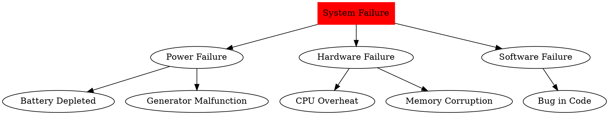

```markdown
# Fault Tree Diagram Example

Below is an example of a fault tree diagram represented in DOT language:



To visualize this fault tree diagram, save the DOT code to a `.dot` file and use Graphviz tools like `dot` to generate an image:

```bash
dot -Tpng fault_tree.dot -o fault_tree.png
```
```

 may indicate a worn bearing.
